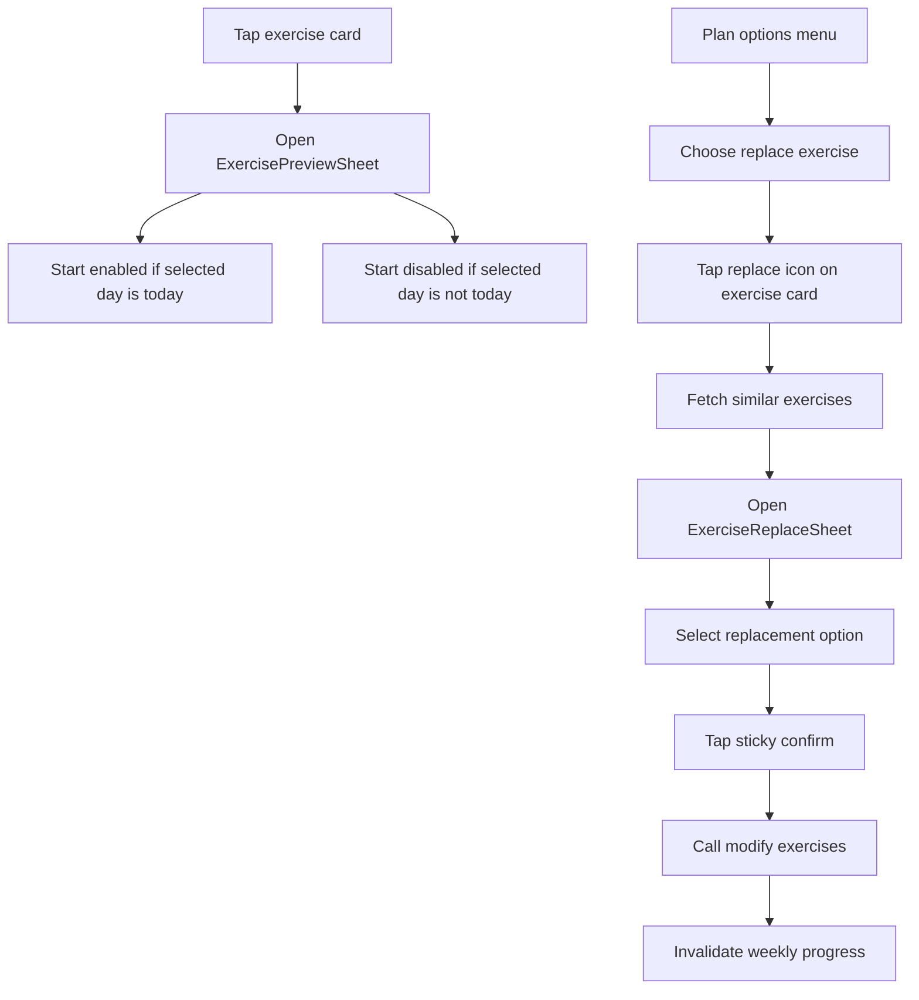

# My Plan — Exercise Preview & Replacement Rework

**Última actualización:** Abril 2026  
**Audiencia:** producto, diseño, v0/Vercel, Cursor, ingeniería frontend  
**Relacionado:** [`my-plan-rework-tech-spec.md`](./my-plan-rework-tech-spec.md), [`../domain/workouts-and-progress.md`](../domain/workouts-and-progress.md), [`../conventions.md`](../conventions.md)

---

## 1. Contexto

La sección `My Plan` ya tiene una base nueva: selector semanal, cards verticales, progreso semanal, animación de completar ejercicio y restricción para completar solo el día actual.

Quedan dos superficies importantes que todavía se sienten fuera del nuevo estándar visual:

1. **Preview del ejercicio** antes de iniciar el workout.
2. **Cambio/reemplazo de ejercicio** dentro del plan.

El objetivo de este documento es servir como brief detallado para generar una propuesta en v0 de Vercel, con suficiente contexto para diseñar una UI premium, minimalista y adaptable al código actual.

---

## 2. Problemas Actuales

### 2.1 Preview del ejercicio

Archivo actual:

- `frontend/app/_components/modals/ExerciseDetailsModal.tsx`

Problemas observados:

- El modal usa una imagen/video demasiado grande con un play gigante al centro.
- La estética no coincide con el nuevo `My Plan`: se siente más viejo, pesado y menos refinado.
- El gradiente inferior de gris a negro se ve agresivo.
- Hay textos hardcodeados o mal mapeados con i18n:
  - `No description available.`
  - `capitalizeFirstLetter('sets')`
  - `capitalizeFirstLetter('reps')`
  - `exercise.level.intermediate` puede mostrarse literal si falta traducción o formato.
- Los iconos actuales se sienten pesados o poco consistentes.
- La información no está priorizada para el usuario:
  - video/preview,
  - nombre,
  - objetivo del ejercicio,
  - sets/reps,
  - descanso,
  - dificultad,
  - acción principal.
- El modal actual parece una pantalla de reproducción más que un preview claro.

### 2.2 Reemplazo/cambio de ejercicio

Archivos actuales:

- `frontend/app/_components/modals/ViewModal.tsx`
- `frontend/app/_components/workouts/ExerciseList.tsx`
- `frontend/app/(app)/workouts/my-plan/[id]/page.tsx`

Problemas observados:

- `ViewModal` es genérico y visualmente antiguo:
  - esquinas pequeñas,
  - título grande,
  - close rojo,
  - layout poco mobile-first.
- `ExerciseList` usa cards grises básicas con spacing pesado.
- El modal no se siente como parte del diseño premium actual.
- Los botones de confirmar/cancelar para modo optional/replacement viven fuera del modal y pueden superponerse con el navbar flotante.
- En mobile, el navbar fijo de abajo puede tapar acciones si no se reserva `safe-area`.
- El flujo actual no comunica bien qué ejercicio está siendo reemplazado ni cuál alternativa está seleccionada.

### 2.3 Navbar flotante

El navbar móvil actual está en:

- `frontend/app/_components/navbar/MobileNavBar.tsx`

Se renderiza como `fixed bottom-8`, por lo que cualquier modal/lista con acciones en la parte inferior debe reservar espacio visual o manejar su propio footer sticky.

---

## 3. Principios De Diseño

Inspiración general:

- Apple Fitness / iOS Health: superficies limpias, tipografía clara, controles mínimos.
- Fitbod / apps fitness premium: preview rápido, datos escaneables, reemplazo sin fricción.
- Material 3 bottom sheets: jerarquía clara, scroll controlado, footer sticky.

Principios:

1. **Media-first, not media-only:** el video o imagen debe ser protagonista, pero no debe comerse toda la jerarquía.
2. **Acción clara:** el usuario debe saber si puede iniciar, reemplazar o solo revisar.
3. **Menos ruido visual:** evitar gradientes pesados, sombras grandes, rojos fuertes innecesarios.
4. **Mobile-first:** todo debe funcionar perfecto en pantallas tipo S8+.
5. **Safe-area aware:** ninguna acción importante debe quedar debajo del navbar flotante.
6. **i18n completo:** cero strings visibles hardcodeados.
7. **Adaptable al repo actual:** usar Tailwind 3, React, Next.js, Framer Motion ya existente.

---

## 4. Dirección UX — Exercise Preview

### 4.1 Concepto

Reemplazar el modal actual por una **Exercise Preview Sheet**.

Debe sentirse como una card expandida desde la lista:

- fondo overlay oscuro suave,
- contenedor blanco/off-white con esquinas grandes,
- media arriba,
- info abajo,
- CTA sticky o claramente visible.

No debe sentirse como un player full workout. Es solo un preview antes de iniciar.

### 4.2 Layout sugerido

En mobile:

```text
Overlay oscuro suave
┌────────────────────────────┐
│ Header flotante: cerrar     │
│ ┌────────────────────────┐ │
│ │ Video/Image preview     │ │
│ │ play pequeño centrado   │ │
│ └────────────────────────┘ │
│                            │
│ Nombre del ejercicio       │
│ Descripción corta          │
│                            │
│ [Sets] [Reps] [Rest] [Lvl] │
│                            │
│ Tips / equipo / músculo    │
│                            │
│ Sticky CTA: Iniciar        │
└────────────────────────────┘
```

### 4.3 Media preview

Preferencia:

- Si existe `video_url`, mostrar un bloque de video preview.
- Si no hay video usable, mostrar `image_url`.
- Si no hay imagen, usar fallback visual:
  - fondo verde/gris suave,
  - iniciales del ejercicio,
  - icono minimalista.

El play:

- Debe ser pequeño/medio, no gigante.
- Sugerido: círculo semitransparente con blur o fondo blanco translúcido.
- Icono minimalista: `FiPlay`, `IoPlay`, `Play` de `lucide-react`.

### 4.4 Contenido

Información mínima:

- Nombre.
- Descripción.
- Sets.
- Reps.
- Descanso.
- Dificultad.
- Muscle group si existe.

Información opcional:

- Equipo.
- Recomendación/tip.
- Video duration si está disponible en el futuro.

### 4.5 Estados

**Día actual, ejercicio no completado**

- CTA principal habilitado: `Iniciar ejercicio`.

**Día no actual**

- CTA disabled.
- Mensaje: `Solo puedes completar el entrenamiento de hoy`.
- El usuario puede revisar el preview, pero no iniciar.

**Ejercicio completado**

- CTA puede decir `Revisar ejercicio` o quedar como disabled según decisión futura.
- Para este rework, mantenerlo simple: preview sigue abriendo y muestra estado completado.

### 4.6 Visual

Preferido:

- Fondo del sheet: `#ffffff` o `#f8faf9`.
- Radius: `rounded-[2rem]` o `rounded-3xl`.
- Borde: `border border-gray-100`.
- Sombra suave.
- Métricas en pills:
  - fondo `gray-50`/`green-50`,
  - texto `gray-700`,
  - iconos `green-500` o `slate-500`.

Evitar:

- Gradiente negro pesado.
- Play gigante animado con pulse permanente.
- Texto muy grande en todos lados.
- Close rojo en preview.

---

## 5. Dirección UX — Exercise Replacement

### 5.1 Concepto

Reemplazar el flujo actual de `ViewModal + ExerciseList + botones externos` por un componente dedicado:

- `ExerciseReplaceSheet`

Debe funcionar como un bottom sheet o centered sheet mobile-first.

Objetivo:

1. Mostrar el ejercicio actual que se va a cambiar.
2. Mostrar alternativas similares.
3. Permitir seleccionar una alternativa.
4. Confirmar o cancelar dentro de la misma sheet.

### 5.2 Layout sugerido

```text
Overlay oscuro suave
┌────────────────────────────┐
│ Header sticky              │
│ Cambiar ejercicio          │
│ Reemplazando: Push-up      │
│                         X  │
├────────────────────────────┤
│ Current exercise mini card │
├────────────────────────────┤
│ Alternatives list          │
│ ┌────────────────────────┐ │
│ │ thumb  title      ○/✓  │ │
│ │ chips: sets reps rest  │ │
│ └────────────────────────┘ │
│ ┌────────────────────────┐ │
│ │ ...                    │ │
│ └────────────────────────┘ │
├────────────────────────────┤
│ Sticky footer              │
│ Cancelar      Reemplazar  │
└────────────────────────────┘
```

### 5.3 Header

Debe comunicar:

- Título: `Cambiar ejercicio`.
- Subtítulo: `Elige una alternativa para {{exerciseName}}`.
- Close minimalista: gris/slate, no rojo.

### 5.4 Current exercise summary

Mostrar una mini card del ejercicio actual:

- thumbnail,
- nombre,
- sets/reps/rest,
- quizás muscle group.

Esto reduce ambigüedad: el usuario sabe qué está cambiando.

### 5.5 Alternative cards

Cada alternativa debe verse como una opción seleccionable premium:

- Thumbnail `64x64` o `72x72`.
- Nombre destacado.
- Descripción muy corta o muscle group.
- Métricas compactas:
  - `3 x 12`
  - `60s descanso`
  - dificultad.
- Indicador de selección:
  - círculo outline si no seleccionado,
  - check verde si seleccionado.

Interacción:

- Tap en card selecciona.
- No confirmar automáticamente al tap.
- Footer `Reemplazar` se habilita cuando hay selección.

### 5.6 Footer sticky

Los botones deben vivir dentro del sheet, no fuera.

Footer:

- `Cancelar`: secondary, blanco/gris, borde sutil.
- `Reemplazar`: primary, verde, disabled si no hay selección.

Debe usar:

```text
padding-bottom: calc(1rem + env(safe-area-inset-bottom))
```

Y si el navbar sigue visible detrás, el sheet debe estar por encima (`z-50`) y su footer no debe quedar tapado.

### 5.7 Empty/loading/error states

**Loading**

- Skeleton cards o spinner sutil.

**No alternatives**

- Empty state:
  - icono minimalista,
  - `No encontramos alternativas por ahora`,
  - botón `Cerrar`.

**Error**

- Mensaje corto y botón retry si existe API disponible.

---

## 6. Iconografía

Preferir iconos minimalistas, consistentes:

- Play: `FiPlay`, `IoPlay`, `Play` from `lucide-react`.
- Sets/reps: `Dumbbell`, `Repeat`, `ListChecks`.
- Rest: `Clock`, `Timer`.
- Difficulty: `Gauge`, `Activity`.
- Replace/swap: `RefreshCw`, `Repeat2`, `Shuffle`.
- Close: `X`.
- Selected: `Check`.

Evitar:

- Iconos demasiado decorativos o pesados.
- Rojo para cerrar.
- Múltiples familias si se puede mantener consistencia.

---

## 7. i18n Requerido

Agregar o corregir claves en:

- `frontend/public/locals/es/global.json`
- `frontend/public/locals/en/global.json`

Sugerencia:

```json
{
  "workouts": {
    "my-plan": {
      "previewExercise": "Vista previa del ejercicio",
      "startExercise": "Iniciar ejercicio",
      "reviewExercise": "Revisar ejercicio",
      "noExerciseDescription": "Aún no hay descripción para este ejercicio.",
      "onlyTodayCompletion": "Solo puedes completar el entrenamiento de hoy",
      "setsLabel": "Sets",
      "repsLabel": "Reps",
      "restLabel": "Descanso",
      "difficultyLabel": "Dificultad",
      "muscleGroupLabel": "Grupo muscular",
      "replaceExerciseTitle": "Cambiar ejercicio",
      "replaceExerciseSubtitle": "Elige una alternativa para {{exerciseName}}",
      "currentExercise": "Ejercicio actual",
      "replacementOptions": "Opciones similares",
      "selectReplacement": "Seleccionar {{exerciseName}}",
      "confirmReplacement": "Reemplazar",
      "cancelReplacement": "Cancelar",
      "noReplacementOptions": "No encontramos alternativas por ahora."
    }
  }
}
```

No usar:

- `capitalizeFirstLetter('sets')`
- strings fijos en JSX.
- keys que puedan mostrarse literal si faltan.

---

## 8. Contratos De Componentes Sugeridos

### 8.1 `ExercisePreviewSheet`

Archivo sugerido:

- `frontend/app/_components/workouts/my-plan/ExercisePreviewSheet.tsx`

Props:

```ts
interface ExercisePreviewSheetProps {
  exercise: Exercise;
  isOpen: boolean;
  onClose: () => void;
  onStartExercise: () => void;
  canStartExercise: boolean;
  disabledReason?: string;
  animationOrigin?: AnimationOriginRect | null;
}
```

Notas:

- Puede reemplazar internamente a `ExerciseDetailsModal`.
- Si se conserva el nombre `ExerciseDetailsModal`, al menos cambiar implementación y props de forma compatible.
- Mantener la animación de entrada desde la card si es posible.

### 8.2 `ExerciseReplaceSheet`

Archivo sugerido:

- `frontend/app/_components/workouts/my-plan/ExerciseReplaceSheet.tsx`

Props:

```ts
interface ExerciseReplaceSheetProps {
  isOpen: boolean;
  currentExercise: Exercise | null;
  options: Exercise[];
  selectedExercise: Exercise | null;
  isLoading?: boolean;
  onSelectExercise: (exercise: Exercise) => void;
  onConfirm: () => void;
  onClose: () => void;
}
```

Notas:

- Debe reemplazar el uso actual de `ViewModal + ExerciseList` para el flujo de cambio de ejercicio.
- Debe contener su propio footer sticky.
- Debe permitir cancelar sin tocar estado global incorrectamente.

### 8.3 `ReplacementExerciseCard`

Archivo sugerido:

- `frontend/app/_components/workouts/my-plan/ReplacementExerciseCard.tsx`

Props:

```ts
interface ReplacementExerciseCardProps {
  exercise: Exercise;
  isSelected: boolean;
  onSelect: () => void;
}
```

---

## 9. Integración Con `page.tsx`

Archivo:

- `frontend/app/(app)/workouts/my-plan/[id]/page.tsx`

Cambios esperados:

1. Reemplazar:

```tsx
{isOptionalExercisesOpen && (
  <ViewModal ...>
    <ExerciseList ... />
  </ViewModal>
)}
```

por:

```tsx
<ExerciseReplaceSheet
  isOpen={isOptionalExercisesOpen}
  currentExercise={exerciseBeingReplaced}
  options={similarExercises}
  selectedExercise={pendingReplacementExercise}
  onSelectExercise={setPendingReplacementExercise}
  onConfirm={handleConfirmExerciseReplace}
  onClose={handleCloseReplaceSheet}
/>
```

2. Eliminar o esconder el action bar externo para `isOptionalMode`:

```tsx
<div className={`h-[10%] ... ${!isOptionalMode ? 'hidden' : ''}`}>
```

3. Mantener el delete mode si no se reworkea en esta fase.

4. Asegurar que cancelar limpia:

- `isOptionalExercisesOpen`
- `exerciseToReplaceId`
- `pendingReplacementExercise`
- no necesariamente `isOptionalMode`, según cómo se quiera mantener el modo.

---

## 10. Flujo Propuesto



---

## 11. Prompt Para v0

Copiar y adaptar:

```text
Create a premium mobile-first fitness UI for the 2fit app, focused on two surfaces inside "Mi plan de entrenamiento": an exercise preview sheet and an exercise replacement sheet.

Context:
- Existing screen uses a calm off-white background, rounded white cards, emerald/green accent, dark navy weekly progress widget, iOS-like floating bottom navbar.
- Design should feel like Apple Fitness / Fitbod / iOS Health: minimal, premium, soft shadows, large rounded corners, clear typography, no clutter.
- Mobile viewport similar to Samsung S8+.

Exercise Preview Sheet:
- Opens when user taps an exercise card.
- Use an overlay and a large rounded sheet.
- Top area is media-first: video preview or image with a small translucent play button.
- Include close button in top-right, minimal gray/white style.
- Below media: exercise name, short description, and metric chips for sets, reps, rest, difficulty, muscle group.
- Main CTA at bottom: "Iniciar ejercicio".
- If exercise cannot be started because selected day is not today, CTA disabled and show message "Solo puedes completar el entrenamiento de hoy".
- Avoid huge play icons, heavy black gradients, red close icons, and outdated card styles.

Exercise Replacement Sheet:
- Opens when user chooses to change an exercise.
- Header: "Cambiar ejercicio" and subtitle "Elige una alternativa para [exercise name]".
- Show a compact current exercise summary card.
- Show a scrollable list of similar exercise options.
- Each option card includes thumbnail, title, short metadata, metric chips, and a circular selected indicator.
- Tap selects an option; do not confirm immediately.
- Sticky footer inside the sheet with "Cancelar" and "Reemplazar".
- Footer must respect safe area and not be covered by floating navbar.
- Empty state and loading skeletons should be included.

Visual style:
- Rounded corners 24-32px.
- Background #f8faf9 or white.
- Subtle borders #e5e7eb and soft shadows.
- Emerald accent for primary actions.
- Slate/gray text hierarchy.
- Minimal line icons.

Output:
- React components using Tailwind CSS.
- No external UI library assumptions beyond standard React/Tailwind.
- Keep code modular: ExercisePreviewSheet, ExerciseReplaceSheet, ReplacementExerciseCard, metric chip helpers.
```

---

## 12. Adaptación Al Repo

Cuando v0 genere código, adaptar con estas reglas:

- No copiar dependencias nuevas sin revisar.
- Mantener Tailwind 3.
- Mantener `react-i18next`.
- Usar tipos existentes `Exercise` y `AnimationOriginRect`.
- Respetar `canStartExercise` y `onlyTodayCompletion`.
- No romper la animación de completar workout en `ExerciseFlow`.
- No reintroducir `/workouts/progress` desde frontend para `myPlan`.
- Evitar strings hardcodeados.
- Revisar mobile S8+.

---

## 13. Acceptance Criteria

### Preview

- Se ve moderno y coherente con el nuevo `My Plan`.
- El video/imagen se entiende como preview.
- El play no domina visualmente.
- Las métricas se leen rápido.
- No aparecen keys i18n literales.
- Días no actuales muestran CTA disabled con copy correcto.
- La animación de apertura desde card se mantiene o se reemplaza por una transición igual de suave.

### Replacement

- El modal viejo ya no se usa para cambiar ejercicio.
- Las opciones se muestran como cards modernas.
- El usuario selecciona una opción y confirma con footer sticky.
- Cancelar y cerrar limpian estado.
- El footer no queda debajo del navbar flotante.
- Con muchas opciones, la lista scrollea y los CTAs siguen visibles.
- Empty/loading states no rompen el layout.

### Técnica

- `npm run typecheck` pasa.
- `npm run lint` pasa.
- No se introducen requests nuevos innecesarios.
- No se modifica backend para este rework visual.

---

## 14. Fuera De Alcance

No incluir en esta fase:

- Rework completo del delete mode.
- Nuevo catálogo de imágenes/videos.
- Analytics de reproducción de video.
- Rehacer `ExerciseFlow`.
- Cambiar el navbar global.
- Cambiar backend de replacement.

---

## 15. Riesgos

| Riesgo | Mitigación |
|--------|------------|
| v0 genera estilos demasiado distintos | Usar tokens del prompt y adaptar manualmente a Tailwind actual. |
| El sheet tapa el navbar o viceversa | Usar `z-50`, footer sticky y `safe-area-inset-bottom`. |
| i18n incompleto | Agregar checklist de keys EN/ES antes de merge. |
| Replacement cambia estado de forma confusa | Separar selección temporal de confirmación real. |
| Preview pierde animación desde card | Mantener `animationOrigin` o usar una transición simple pero consistente. |

---

## 16. Checklist De Implementación Posterior

- [ ] Crear/recibir propuesta v0.
- [ ] Separar componentes en archivos pequeños.
- [ ] Adaptar i18n EN/ES.
- [ ] Reemplazar `ExerciseDetailsModal`.
- [ ] Reemplazar `ViewModal + ExerciseList` solo para replacement.
- [ ] Mover confirm/cancel de replacement dentro del sheet.
- [ ] Revisar S8+ con navbar.
- [ ] Correr lint/typecheck.
- [ ] Hacer QA manual de preview, replacement, cancel, confirm y empty states.
